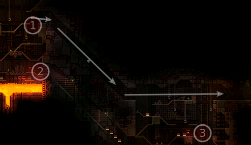
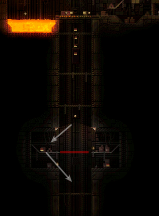
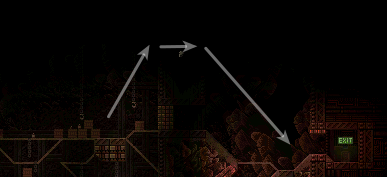
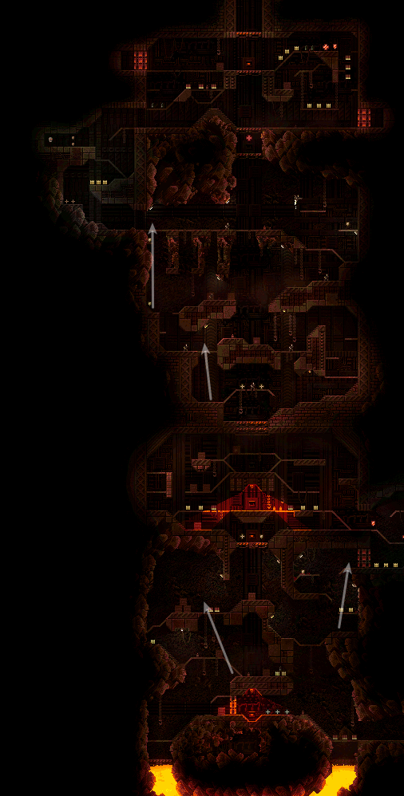
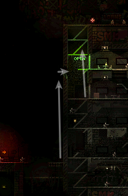
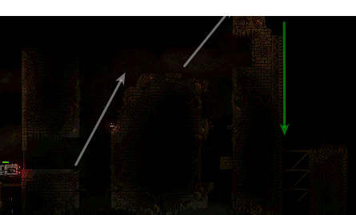
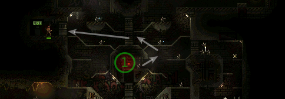
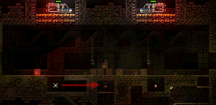
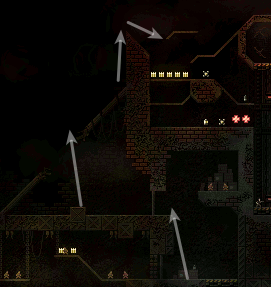

# butcher skips

## Ironworks Facility
### h1m1
#### level skip

If you make it to [1] fast enough (with saw boosts or shotgun boosts and bunny hopping) you can skip both buttons (2) and (3), completing the level under 13 seconds.

### h1m2
### h1m3
### h1m4
#### second elevator skip

If you have enough health, you can go under the second elevator, drop into lava and swim to your right. Here's a video of execution:

## Old Military Base
### h2m1
### h2m2
### h2m3
### h2m4

## Jungle
### h3m1
### h3m2
### h3m3
### h3m4

## Volcano research station
### h4m1
#### arena skip

Just granade jump out of the arena instead of fighting it.
### h4m2
### h4m3
### h4m4
#### granade jumps

Plenty of granade jumps possible here.

## Last City
### h5m1
#### Second building skip

Granade jump with a help of shotty boost up, go through a hole and then granade jup right to the top.

#### First arena skip

Two granade jumps will take you up. You can hug the wall while attacking it with a saw to avoid fall damage (pictured as green arrow).

### h5m2
#### Final sequence skip

After pressing the button (1) go up and straight to the exit before the wall cuts you off.
### h5m3
### h5m4
#### Police cars fight skip

Kill the worker with your railgun as pictured by the red arrow, so he can't open the roof doors.

#### final sequence skip

Granade jump straight to the arena.
